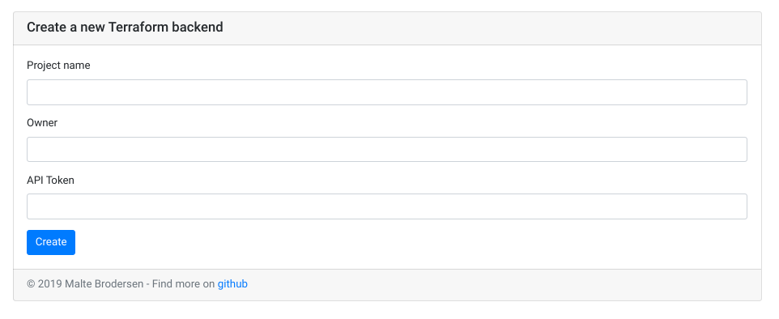
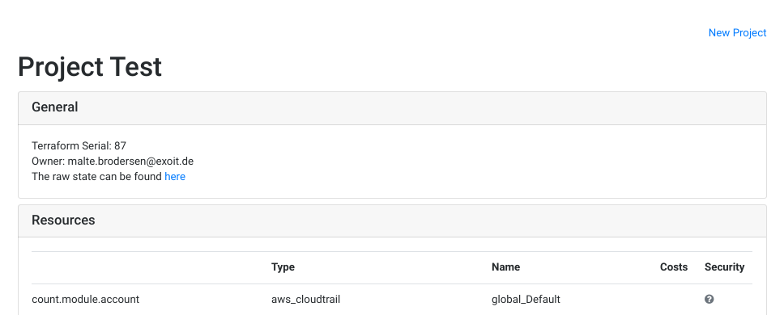
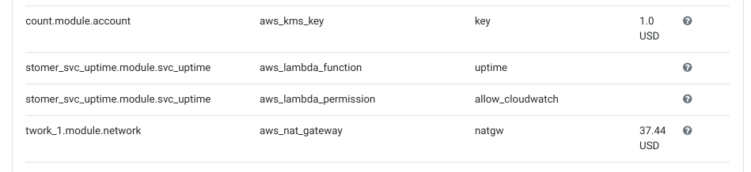
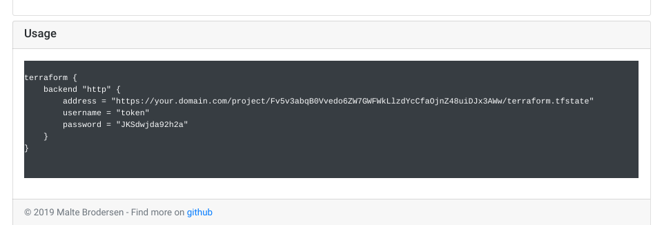

# About the project
This project is targeting to provide an easy to use s3 backend for [terraform](https://www.terraform.io/).  
You may complain that there is already a built-in backend for aws s3 which can be used.
And yes - you are right the is something similar but also different as this approach. Further details can be found [here](#problems-of-the-build-in-s3-backend)

## Features
- [x] Offer a Webinterface for creation of backends
- [x] Inspect the state of each project in a webui
- [x] Offer a diffrent token for each new Project
- [ ] Show if the project fulfills the security requirements of your organistation
- [ ] The an cost estimate based on the used ressources

## Demo
A demo installation can be found [here](https://terraform.exoit.de/project/new) (admin/r3pl4c3m3).

## Screenshots
### New project

### Project status





## Problems of the build-in s3 backend
- Some setup effort required
  - IAM users must be created and maintained for each project
  - A Bucket (or complex policy) must be created
  - Can be handled by for example [terragrunt](https://github.com/gruntwork-io/terragrunt) but this is also one further component
- If you want to do it right, you have to handle two AWS credentials which the same time (for tf and the backend)  

## Idea behind this approach
The idea is to make it as easy as possible to use remote beackends. At the same time a normal level of security should be keeped.  
To achive this, the project has just need to be set up ONCE for your organization. Afterward, everyone can set up the backend for terraform by his own.  
By to so, a new uniqe ID will be created which can be used. Currently the ID is an random alpha numerical key. 

To use it an HTTP endpoint is provided which can add to your terraform project. 
In behind all data (tfstate and config) are stored in a bucket in a folder named after the project id. This bucket has versioning enabled of cause.


# Setup
## Deploy the server-side
```
git clone https://github.com/derBroBro/terraform-http-backend.git
cd terraform-http-backend/deploy
terraform apply
```
> You must provide a name for the project. This will be used for the functions, IAM user and the bucket.

### Using a cust domains
Using custom domains is quite easy, just pass in the `domain` and `cert_arn` variables.
The `cert_arn` must be a verfied ACM certificate in the us-east-1 region.
After this you need to create a CNAME Record for your domain pointing to the API Gateways Endpoint. Details what to configure will be shown in the outputs.

## For each project
Visit your https://yourdomain/project/new to create a new project.  
After creation you will get to the overview of your project. On this you find also an `backend_http.tf` config which should be added to your projects.

# Further opportunities
There are a lot of extensions possible for this backend.
Just some ideas:  
- [ ] Trigger a central webhook for each state-change  
- [x] List and show all states on a central place 
- [ ] Central state locking
- [ ] Cost warnings (base is set. Baybe [lyft/awspricing](https://github.com/lyft/awspricing) is helpfull)
- [ ] Security checks (public buckets etc.)
- [ ] Pen-Test after state changes
- [ ] Send a brief summary as a notification

# Todo
- [ ] Setup proper testing
- [x] Setup basis auth instead of the key-based
- [x] Add custom Domains
- [ ] Add SNS to subscribe on changes
- [ ] Generate report asynchronously (Required for notifications and pentests) 


